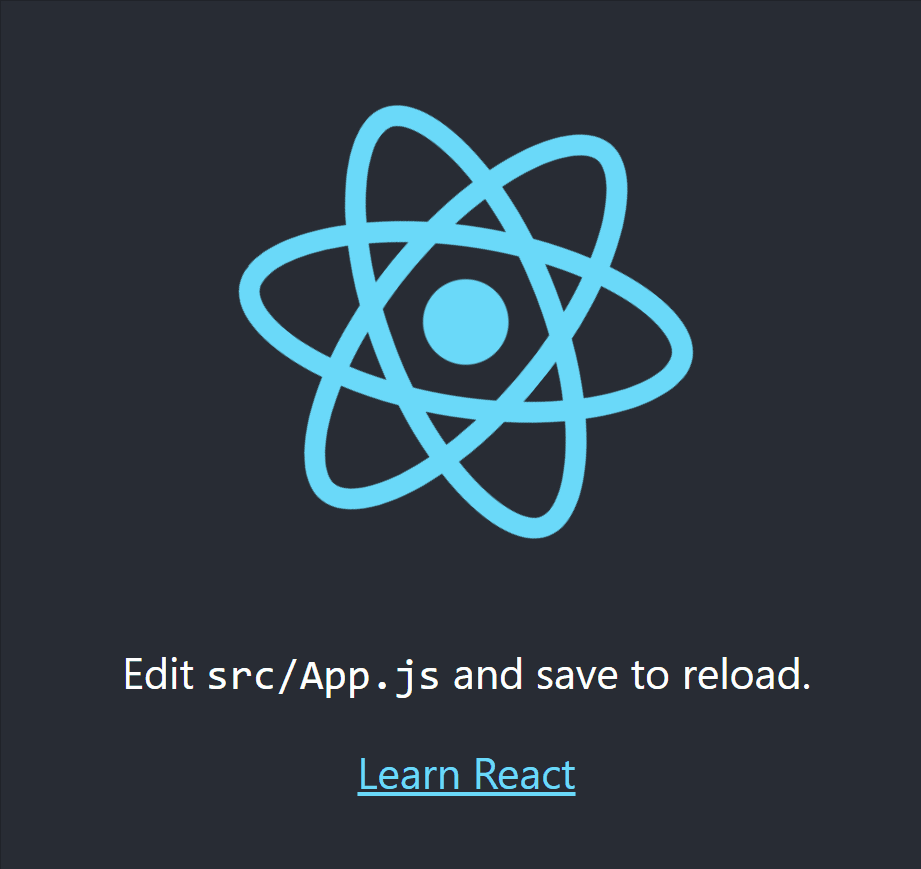

# #100DaysOfCode Log - Round 1 - [Pavel Furtsev]

The log of my #100DaysOfCode challenge. Started on [June 11, Monday, 2023].

## Log

### R1D1
#### 11.06.23
I am happy and excited to start this chellange. Here is my progress today:

Grinding through the [Full-Stack Engineer](https://www.codecademy.com/career-journey/full-stack-engineer) path on [codecademy](https://www.codecademy.com/) *(2 hours)*
- learned how to "Spinning Up A Local Server" ([resource](https://www.codecademy.com/article/spinning-up-a-local-server))
- learned ES6 modules ([resource](https://developer.mozilla.org/en-US/docs/Web/JavaScript/Guide/Modules))
- learned Error handling with 'try-catch'

#JavaScript
#VSCode
#FullStack
#100DaysOfCode

### R1D2
#### 13.06.23
Working on the [Full-Stack Engineer](https://www.codecademy.com/career-journey/full-stack-engineer) path on [codecademy](https://www.codecademy.com/) *(2.5 hours)*
- learned about Testing and TDD
- tried to use Mocha for testing with assertion methods
- learned about descriptive testing and Red-Green-Refactor approach

### R1D3
#### 14.06.23
Working on the [Full-Stack Engineer](https://www.codecademy.com/career-journey/full-stack-engineer) path on [codecademy](https://www.codecademy.com/) *(2 hours)*
- created a sample project: factorial calculation with TDD approach (Red-Green-Refactor)
- code coverage concept
- mocking and Sinon.js
- introduction to async and promises

### R1D4
#### 19.06.23
Back to learning *(2.5 hours)*
- Promise and async-await
- APIs and HTTP requests with `fetch`

### R1D5
#### 20.06.23
Finally learning React *(4 hours)*
- Intro to React, virtual DOM and JSX
- React components

### R1D6
#### 21.06.23
Continiung on basics of React *(1 hour)*
- components' interactions and props

### R1D7
#### 22.06.23
Learned *(2.5 hours)*
- Simple forum project with React
- React DevTools for debugging
- React hooks with `useState`